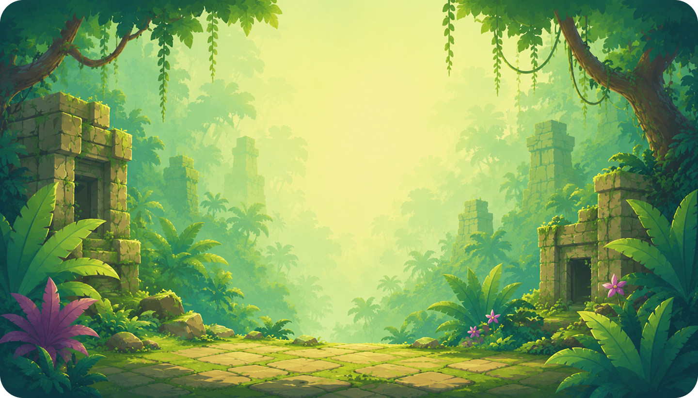
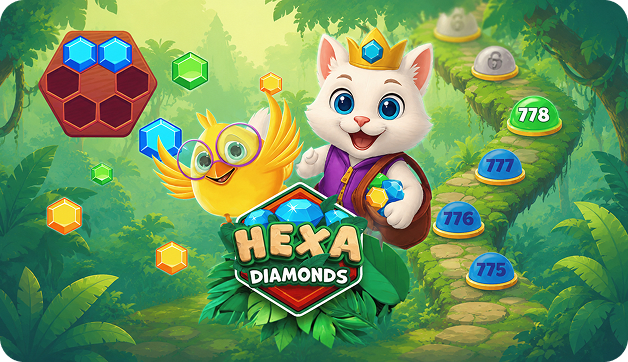
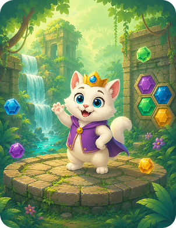
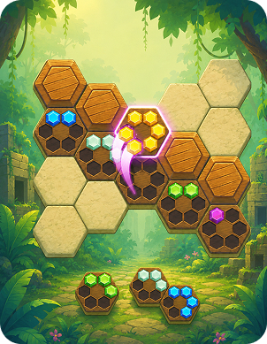
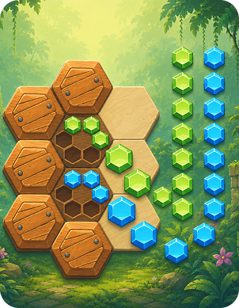
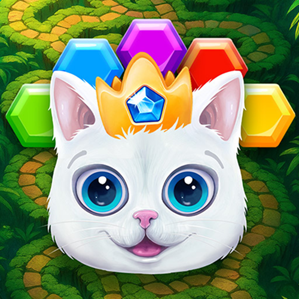

# Hexa Diamonds

### Think Sharp. Shine Bright.



<p align="center">
  <em>Relaxing hexagon puzzles powered by magical diamonds.<br/>
  Every piece fits. Every puzzle shines.</em>
</p>

<p align="center">
  <a href="https://play.google.com/store/apps/details?id=com.remivision.HexaDiamonds&hl=en&gl=us">
    <strong>◇ Get it on Google Play ◇</strong>
  </a>
  &nbsp;·&nbsp;
  <a href="https://novaparcel.space/">Website</a>
  &nbsp;·&nbsp;
  <a href="./src/privacy-policy.html">Privacy</a>
  &nbsp;·&nbsp;
  <a href="./src/terms.html">Terms</a>
</p>

---

## A puzzle built for calm, focused thinking

Hexa Diamonds challenges players to place **diamonds**, **squares**, and **triangular gems** onto a hexagonal grid — rewarding careful spatial planning over speed.

Guided by a magical puzzle companion, you work through progressively intricate layouts designed to sharpen logic while staying relaxing and low-pressure.

The atmosphere feels elegant, meditative, and visually polished — soft glows, gem sparkle, and a jungle path that invites you to slow down.

<p align="center">
  
</p>

---

## How to play

| Step | What you do |
|:----:|-------------|
| **1** | **Study the Grid** — examine the hexagonal board before placing pieces |
| **2** | **Place Gem Shapes** — fit diamonds, squares, and triangles into open spaces |
| **3** | **Clear Full Rows** — complete lines to clear space and score points |
| **4** | **Plan Ahead** — anticipate upcoming shapes to avoid dead ends |
| **5** | **Progress Through Puzzles** — advance through increasingly complex hexagon layouts |

```
        ◆
     ◆     ◆
  ◆     ○     ◆
     ◆     ◆
        ◆
```

<p align="center"><em>Simple placement. Deep strategy.</em></p>

---

## Features

| | |
|:--|:--|
| **◈ Hexagonal Grid Mechanics** | A fresh spatial twist on classic placement puzzles |
| **◈ Calming Visual Design** | Soft glows and gem sparkle that support a relaxed mood |
| **◈ No Time Pressure** | Puzzles reward thoughtful planning over speed |
| **◈ Diverse Gem Shapes** | Diamonds, squares, and triangles create varied challenges |
| **◈ Magical Companion** | A puzzle companion guides players through the journey |

<p align="center">
  
  &nbsp;
  
  &nbsp;
  
</p>

---

## What players are saying

> *“Such a relaxing way to exercise my brain.”* — HexMindPlayer ★★★★★

> *“Love the hexagon twist on classic block puzzles.”* — PuzzleFox ★★★★★

> *“Perfect evening unwind — no timers, just clever layouts.”* — CalmGamer42 ★★★★★

---

## This repository

Landing page for **Hexa Diamonds** — a Vite + HTML/CSS/JS promotional site with sticky header, responsive layout (375 → 1440), SEO, and legal pages.

### Stack

- [Vite](https://vitejs.dev/) · HTML partials · modern CSS
- Image optimization on build · Google Fonts (Nunito, Luckiest Guy, Nerko One, …)

### Quick start

```bash
npm install
npm run dev
```

| Script | Description |
|--------|-------------|
| `npm run dev` | Local development server |
| `npm run build` | Production build (`base=/STPP-395/`) |
| `npm run preview` | Preview the production build |

### Project map

```
src/
├── index.html              # Home — hero, about, how-to-play, features, reviews, contact
├── privacy-policy.html
├── terms.html
├── partials/               # Header, footer, sections
├── css/                    # Design tokens & section styles
├── js/                     # Burger menu, sliders, scroll helpers
├── img/                    # Art & UI assets
└── public/                 # favicon, sprite, robots, sitemap, og-image
```

---

## Contact

Questions about the game or this site:  
**[info@novaparcel.space](mailto:info@novaparcel.space)**

---

<p align="center">
  
</p>

<p align="center">
  <strong>Hexa Diamonds</strong><br/>
  <em>Think sharp. Shine bright.</em><br/><br/>
  © 2026 novaparcel.space — All rights reserved.
</p>
